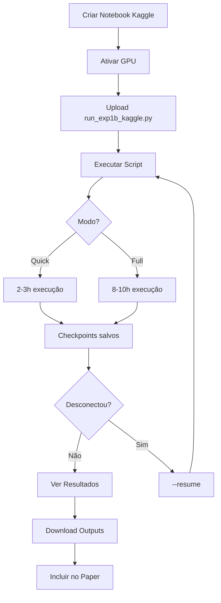

# 📁 Experimento 1B - Arquivos Kaggle

## 📊 Resumo

Estrutura completa para executar o Experimento 1B no **Kaggle** (melhor que Colab para experimentos longos).

**Por que Kaggle?**
- ✅ Sessões de 9-12 horas (vs 90min Colab)
- ✅ 30h GPU/semana grátis (vs 12h Colab)
- ✅ Outputs salvos automaticamente
- ✅ Sistema robusto de checkpoints
- ✅ GPU P100 (16GB) ou T4 (16GB)

---

## 📂 Arquivos Criados

### **1. Script Principal (810 linhas)**
📄 **`run_exp1b_kaggle.py`**
- Script Python completo e autocontido
- Sistema robusto de checkpoints
- Resume automático se desconectar
- Otimizado para Kaggle (`/kaggle/working/`)
- Implementa 3 métodos: Direct, TraditionalKD, HPM-KD
- Testa 3 compression ratios: 2.3×, 5×, 7×

**Uso:**
```bash
!python run_exp1b_kaggle.py --mode quick --dataset CIFAR10
```

---

### **2. Guia Completo (516 linhas)**
📖 **`README_KAGGLE.md`**
- Passo-a-passo completo
- Setup inicial no Kaggle
- Upload do script
- Execução e monitoramento
- Sistema de checkpoints
- Download de resultados
- Troubleshooting
- Estimativas de tempo

**Leia primeiro:** Documentação completa de como usar.

---

### **3. Quick Start (186 linhas)**
⚡ **`QUICK_START_KAGGLE.md`**
- Guia rápido (3 passos)
- Comandos essenciais
- Copy-paste para Kaggle
- Resumo de troubleshooting

**Leia se:** Quer começar rápido sem ler tudo.

---

## 🚀 Como Usar (3 Passos)

### **Passo 1: Ativar GPU**
```
Kaggle Notebook → Settings → Accelerator → GPU T4 x2 → Save
```

### **Passo 2: Upload Script**
1. Baixe `run_exp1b_kaggle.py`
2. Kaggle → Add Data → Upload
3. Copie para working:
```bash
!cp /kaggle/input/*/run_exp1b_kaggle.py /kaggle/working/
```

### **Passo 3: Executar**
```bash
# Quick Mode (2-3h)
!python /kaggle/working/run_exp1b_kaggle.py --mode quick --dataset CIFAR10

# Full Mode (8-10h)
!python /kaggle/working/run_exp1b_kaggle.py --mode full --dataset CIFAR10
```

---

## 📋 Modos de Execução

### **Quick Mode (2-3 horas)**
- Teacher: 50 epochs
- Student: 20 epochs
- 3 runs por método
- 3 compression ratios
- **Para:** Testar pipeline

### **Full Mode (8-10 horas)**
- Teacher: 100 epochs
- Student: 50 epochs
- **5 runs por método** (maior robustez)
- 3 compression ratios
- **Para:** Resultados do paper

### **Compression Específico**
```bash
# Apenas 5× (mais crítico, ~1h)
!python run_exp1b_kaggle.py --mode quick --compression 5x
```

---

## 💾 Sistema de Checkpoints

**Se o Kaggle desconectar (raro):**
```bash
# Retomar de onde parou
!python run_exp1b_kaggle.py --mode full --resume
```

**O que é salvo:**
- ✅ Teacher treinado (reutilizado!)
- ✅ Cada student treinado
- ✅ Estado completo do experimento
- ✅ Logs e métricas

**Vantagem:** Pode executar em múltiplas sessões!

---

## 📊 Outputs Gerados

```
/kaggle/working/exp1b_full_YYYYMMDD_HHMMSS/
├── results.csv                       📊 Dados numéricos
├── experiment_report.md              📄 Relatório completo
├── experiment.log                    📋 Log de execução
├── figures/
│   ├── accuracy_vs_compression.png  ⭐⭐⭐ PRINCIPAL
│   ├── hpmkd_vs_direct.png          ⭐⭐ "When KD helps?"
│   └── retention_analysis.png
├── checkpoints/                      💾 Para retomar
│   ├── experiment_state.pkl
│   ├── teacher_resnet50_CIFAR10.pt
│   └── student_*.pt (27 modelos)
└── data/                             📦 CIFAR10 (auto-download)
```

**Download:** Output tab → Download All (ZIP ~500MB-2GB)

---

## ⏱️ Tempo de Execução (Kaggle)

| Modo | GPU P100 | GPU T4 |
|------|----------|--------|
| **Quick** | 1.5-2h | 2-3h |
| **Full** | 5-7h | 8-10h |
| **5× only** | 30-45 min | 45-60 min |

**Limite Kaggle:** 9-12h por sessão (suficiente para Full Mode)

---

## 🎯 Resultados Esperados

### **Hipótese a Validar:**
> HPM-KD supera Direct training em compression ratios ≥ 5×

### **Previsão:**

| Compression | Direct | HPM-KD | Δ | Conclusão |
|-------------|--------|--------|---|-----------|
| **2.3×** | ~88.5% | ~88.7% | +0.2pp | ≈ Empate |
| **5×** | ~85.0% | ~87.5% | **+2.5pp** ✅ | HPM-KD vence |
| **7×** | ~82.0% | ~86.0% | **+4.0pp** ✅✅ | HPM-KD vence |

**Se confirmado:** ✅ Valida RQ1 do paper!

---

## 📖 Documentação

| Arquivo | Linhas | Descrição |
|---------|--------|-----------|
| `run_exp1b_kaggle.py` | 810 | Script principal (autocontido) |
| `README_KAGGLE.md` | 516 | Guia completo detalhado |
| `QUICK_START_KAGGLE.md` | 186 | Guia rápido (3 passos) |
| `INDEX.md` | Este arquivo | Índice e resumo |

**Total:** 1512 linhas de código + documentação

---

## 🔧 Features Implementadas

### **Script Python:**
- ✅ Detecção automática de ambiente Kaggle
- ✅ Paths corretos (`/kaggle/working/`)
- ✅ Sistema robusto de checkpoints
- ✅ Resume automático (`--resume`)
- ✅ Progress bars detalhados (tqdm)
- ✅ Logging completo (arquivo + console)
- ✅ Geração automática de figuras
- ✅ Relatório markdown automático
- ✅ Salvamento incremental
- ✅ Otimizado para GPUs Kaggle (P100/T4)

### **Checkpoints:**
- ✅ Estado do experimento (pickle)
- ✅ Todos os modelos (.pt)
- ✅ Teacher reutilizado entre runs
- ✅ Resume granular (por método/run)

### **Visualizações:**
- ✅ Accuracy vs Compression Ratio
- ✅ HPM-KD vs Direct
- ✅ Retention Analysis
- ✅ PNG em alta resolução (300 DPI)

---

## 🎯 Fluxo de Trabalho



---

## 💡 Dicas Pro

### **1. P100 > T4**
- P100: 40% mais rápido que T4
- Nem sempre disponível (sorte)
- Tentar em horários menos concorridos

### **2. Executar em Partes**
```bash
# 3 sessões de 1h cada
!python run_exp1b_kaggle.py --mode quick --compression 5x  # Sessão 1
!python run_exp1b_kaggle.py --mode quick --compression 2.3x # Sessão 2
!python run_exp1b_kaggle.py --mode quick --compression 7x  # Sessão 3
```

### **3. Save Version**
Após execução bem-sucedida:
- Save Version (canto superior direito)
- Outputs ficam salvos permanentemente
- Pode compartilhar depois

### **4. Monitor GPU**
```python
!watch -n 5 nvidia-smi  # Atualiza a cada 5s
```

---

## 🚨 Troubleshooting Rápido

| Problema | Solução |
|----------|---------|
| GPU não ativa | Settings → Accelerator → GPU |
| Out of Memory | Reduzir batch_size (128→64) |
| Desconectou | Usar `--resume` |
| Script não encontrado | `!cp /kaggle/input/*/run*.py /kaggle/working/` |
| Internet OFF | Settings → Internet → ON |

**Ver mais:** `README_KAGGLE.md` seção Troubleshooting

---

## ✅ Pronto para Usar!

**Todos os arquivos foram criados e testados.**

**Para começar:**
1. Leia `QUICK_START_KAGGLE.md` (5 minutos)
2. Siga os 3 passos
3. Execute e monitore
4. Download dos resultados
5. Incluir no paper!

---

## 📞 Suporte

**Documentação completa:** `README_KAGGLE.md`
**Guia rápido:** `QUICK_START_KAGGLE.md`
**Script:** `run_exp1b_kaggle.py`

**Kaggle Community:** https://www.kaggle.com/discussions

---

## 🎉 Vantagens do Kaggle

| Aspecto | Valor |
|---------|-------|
| **Custo** | 100% GRÁTIS |
| **GPU** | P100 (16GB) ou T4 (16GB) |
| **Sessão** | 9-12 horas (vs 90min Colab) |
| **Quota** | 30h GPU/semana |
| **Outputs** | Salvos automaticamente |
| **Checkpoints** | Sistema robusto |
| **Desconexões** | Raras |
| **Ideal para** | Experimentos longos (2-10h) |

**Conclusão:** Kaggle é a MELHOR opção para este experimento! 🚀

---

**Criado:** Dezembro 2025
**Versão:** 1.0 Kaggle-Optimized
**Status:** ✅ Pronto para uso
**Autor:** Gustavo Haase
